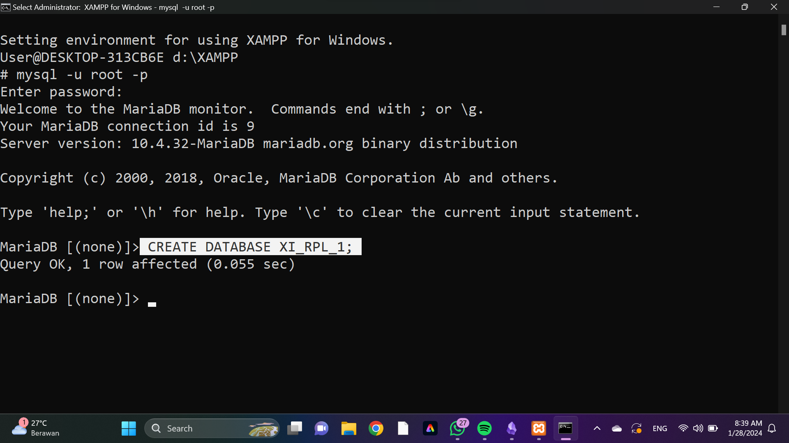

# Instalasi MySQL
Buka Aplikasi XAMPP
## Menggunakan XAMPP
1. Buka XAMPP 
2. Klik tombol ``START`` di MySQL
3. Klik ``Shell``
4. Masuk ke database dengan akun administrator ``mysql -u root -p``
	Passwordnya kosong, jadi silahkan langsung **ENTER**
5. Buat Database
- ``CREATE DATABASE [nama_database];``
6. Tampilkan Database
- ``SHOW DATABASES;``
7. Hapus Database
- ``DROP DATABASE [nama_database];``
8. Menggunakan Database
- ``USE [nama_database];``

## Link Referensi Video YouTube 

[Link YouTube](https://youtu.be/sZEkM4kxY0c?si=eB_PWTS6J-nGo7Nk)
# Penggunaan Awal MySQL
## Query
``MySQL -u root -p``
## Hasil

## Analisis
- ``MySQL`` adalah perintah untuk memanggil program MySQL dari baris perintah.
- ``-u`` diikuti oleh nama pengguna (username) yang akan digunakan untuk masuk ke server MySQL. Dalam contoh ini, "root" adalah nama pengguna yang digunakan.
- ``root`` Merupakan nilai dari argumen -u, yaitu nama pengguna yang digunakan untuk masuk ke server MySQL.
- ``-p`` menunjukkan bahwa setelahnya akan diminta password pengguna untuk masuk. Jika tidak disertakan secara langsung di baris perintah, MySQL akan meminta password secara interaktif setelah Anda menekan Enter.
## Kesimpulan
Perintah `mySQL -u root -p` adalah sebuah perintah untuk memanggil mysql.

# Database
## Buat Database
### Struktur Query
``CREATE DATABASE [nama_database];``
### Contoh Query
`CREATE DATABASE XI_RPL_1;`
### Hasil

### Analisis
- ``CREATE DATABASE`` digunakan untuk membuat database baru.
- ``[nama_database]`` Anda akan mengganti [nama_database] dengan nama yang Anda inginkan untuk database tersebut. Misalnya, jika Anda ingin membuat database dengan nama "XI_RPL_1", maka query yang tepat akan menjadi:
	``CREATE DATABASE XI_RPL_1;``
- ``;``  digunakan sebagai pemisah antara pernyataan atau instruksi individual dalam query SQL. Dengan menggunakan tanda titik koma, Anda memberi tahu sistem manajemen basis data bahwa perintah yang satu telah selesai dan perintah berikutnya akan dimulai.
- ``QUERY OK`` umumnya digunakan sebagai tanggapan dari sistem manajemen basis data untuk memberi tahu pengguna bahwa query telah diterima dan berhasil dieksekusi.
### Kesimpulan
perintah `create database` digunakan untuk membuat database

## Tampilkan Database
### Struktur Query
``SHOW DATABASES;``
### Contoh Query
`SHOW DATABASES;`
### Hasil


### Analisis
- ``SHOW DATABASES`` bertujuan untuk menampilkan semua daftar basis data yang ada dalam sistem manajemen basis data.
- ``;``  digunakan sebagai pemisah antara pernyataan atau instruksi individual dalam query SQL. Dengan menggunakan tanda titik koma, Anda memberi tahu sistem manajemen basis data bahwa perintah yang satu telah selesai dan perintah berikutnya akan dimulai.
- ``QUERY OK`` umumnya digunakan sebagai tanggapan dari sistem manajemen basis data untuk memberi tahu pengguna bahwa query telah diterima dan berhasil dieksekusi.
### Kesimpulan
Perintah `SHOW DATABASES` digunakan untuk menampilkan daftar database yang sudah kita buat.

## Hapus Database
### Struktur Query
``DROP DATABASE [nama_database];
### Contoh Query
`DROP DATABASE XI_RPL_1;`
### Hasil

### Analisis
- ``DROP DATABASE`` bertujuan untuk menghapus sebuah basis data yang ada dalam sistem manajemen basis data.
- ``[nama_database]`` Anda akan mengganti [nama_database] dengan nama basis data yang ingin Anda hapus. Misalnya, jika Anda ingin menghapus basis data dengan nama "XI_RPL_1", maka query yang tepat akan menjadi:
	``DROP DATABASE XI_RPL_1;`
- ``;``  digunakan sebagai pemisah antara pernyataan atau instruksi individual dalam query SQL. Dengan menggunakan tanda titik koma, Anda memberi tahu sistem manajemen basis data bahwa perintah yang satu telah selesai dan perintah berikutnya akan dimulai.
- ``QUERY OK`` umumnya digunakan sebagai tanggapan dari sistem manajemen basis data untuk memberi tahu pengguna bahwa query telah diterima dan berhasil dieksekusi.
### Kesimpulan
`DROP DATABASE` digunakan untuk menghapus database yang sudah benar" tidak diperlukan lagi.

## Gunakan Database
### Struktur Query
`USE [nama_database];`
### Contoh Query
`USE XI_RPL_1;`
### Hasil

### Analisis
- ``USE`` bertujuan untuk mengarahkan perintah-perintah SQL selanjutnya untuk menggunakan atau bekerja dengan basis data yang ditentukan.
- ``[nama_database]`` Anda akan mengganti [nama_database] dengan nama basis data yang ingin Anda gunakan. Misalnya, jika Anda ingin menggunakan basis data dengan nama "XI_RPL_1", maka query yang tepat akan menjadi:
	``USE XI_RPL_1;`
- ``;``  digunakan sebagai pemisah antara pernyataan atau instruksi individual dalam query SQL. Dengan menggunakan tanda titik koma, Anda memberi tahu sistem manajemen basis data bahwa perintah yang satu telah selesai dan perintah berikutnya akan dimulai.
- ``Database changed`` pesan ini menunjukkan bahwa basis data yang aktif atau konteks basis data telah diubah menjadi basis data yang ditentukan.
### Kesimpulan
`USE` merupakan perintah untuk menggunakan database yang akan digunakan, sehingga kita bisa mengatur aktifitas database yang digunakan.

# Tipe Data
## Angka
- INT: Menyimpan bilangan bulat dalam rentang tertentu.
- TINYINT: Menyimpan bilangan bulat kecil.
- BIGINT: Menyimpan bilangan bulat besar.
- DECIMAL: Menyimpan angka desimal dengan presisi yang ditentukan.
- FLOAT: Menyimpan angka desimal dengan presisi yang lebih rendah daripada DECIMAL.
- DOUBLE: Menyimpan angka desimal dengan presisi ganda daripada FLOAT.
## Teks
- CHAR: Menyimpan string dengan panjang tetap.
- VARCHAR: Menyimpan string dengan panjang variabel.
- TEXT: Menyimpan teks panjang yang lebih besar daripada VARCHAR.
## Tanggal & Waktu
- DATE: Menyimpan tanggal (YYYY-MM-DD).
- TIME: Menyimpan waktu (HH:MM:SS).
- DATETIME: Menyimpan tanggal dan waktu (YYYY-MM-DD HH:MM:SS).
## Boolean
- BOOLEAN: Menyimpan nilai benar (TRUE) atau salah (FALSE).
## Binary
- BLOB: Menyimpan data biner seperti gambar atau file.
## Pilihan
- ENUM: Menyimpan satu nilai dari daftar nilai yang ditentukan (hanya bisa memilih 1 pilihan).
- SET: Menyimpan beberapa nilai dari daftar nilai yang ditentukan (bisa memilih lebih dari 1 pilihan).

# Tabel
## Buat Tabel
### Struktur Query
`create table [nama_tabel];`
### Contoh Query
`create table mobil;`
### Hasil

### Analisis
`create table` adalah perintah untuk membuat tabel.
`mobil` adalah nama tabel yang akan dibuat.
### Kesimpulan
Untuk membuat tabel, ketiklah perintah `create table` dan nama tabel yang akan dibuat.

## Struktur Buat Tabel
### Struktur Query

```mysql
CREATE TABLE [nama_table] (
-> nama_field1 tipe_data(jumlah karakter) ket_primary key ket_null,
-> nama_field2 tipe_data(jumlah karakter) ket_null unique(opsional),
-> nama_field3 tipe_data(jumlah karakter) ket_null unique(opsional));
```
### Contoh Query
```mysql
CREATE TABLE mobil (
-> nama_mobil varchar(20) primary key not null,
-> plat_mobil char(15) not null unique,
-> warna_mobil varchar(10) not null unique);
```
### Hasil

### Analisis
jadi secara urutan adalah: nama field, tipe data(jumlah karakter) dan keterangan perintahnya.
terdapat 4 baris yang dimana baris 1 adalah perintah membuat tabel dan baris 2 sampai 4 adalah daftar field yang akan dibuat pada tabel kita serta diakhiri dengan tutup kurung sebagai penutup.

nama_mobil diberikan primary key yang berarti kunci utama dari tabel, sedangkan plat_mobil dan warna_mobil diberikan unique key yang berarti dapat memiliki nilai yang tidak boleh duplikat .
### Kesimpulan
Perintah-perintah yang dituliskan bertujuan untuk membuat filed dari tabel tersebut.
## Tampilkan Struktur Tabel
### Struktur Query

```mysql
desc [nama_tabel];
```
### Contoh Query
```mysql
desc mobil;
```
### Hasil

### Analisis
- `desc`: perintah untuk menampilkan filed tabel tersebut.
- `mobil`: nama tabel yang mau dicek desk nya.
### Kesimpulan
Jadi perintah `desc mobil` adalah untuk melihat field atau atribut dari tabel mobil.
## Menampilkan Daftar Tabel

### Struktur Query
```mysql
show tables;
```
### Contoh Query
```mysql
show tables;
```
### Hasil

### Analisis
Pada database rental_alya terdapat 1 tabel yaitu bernama table "mobil", yang sudah dibuat sebelumnya.  Jadi untuk melihat tabel yang sudah dibuat maka ketik `show tables;` maka tabel yang berhasil dibuat akan tampil.
### Kesimpulan
Perintah `show tables;` digunakan untuk melihat daftar tabel yang sudah dibuat di database.
# QnA

>[!Faq]- Perbedaan Primary Key & Unique?
>

>[!Faq]- Mengapa hanya kolom_id pelanggan yang menggunakan primary key?
>

>[!faq]- Apa itu SET pada query update?
>
# INSERT
## Insert 1 data
### Struktur Query
```mysql
INSERT INTO [nama_tabel]
VALUES (nilai1, nilai2, nilai3,...);
```
### Contoh Query
```mysql
INSERT INTO Pelanggan
VALUES (1, "REZKY", "AWALYA", "082345952007");
```
### Hasil

### Analisis
1. `insert into` adalah query yang digunakan untuk menginput isi table
2. `pelanggan` adalah nama table yang ingin di isi
3. `(nilai1, nilai2, nilai3)` nama kolom yang hanya akan di isi
4. `values` adalah query yang di gunakan untuk memasukkan nilai ke kolom
5. `(1, "REZKY", "AWALYA", "082345952007")` merupakan nilai yang akan di masukkan

### Kesimpulan
Untuk memasukan data gunakan perintah `insert into` dan diikuti dengan data-datanya/nilai".
## Insert >1 data
### Struktur Query
```mysql
INSERT INTO [nama_tabel]
VALUES (2, "nilai1", "nilai2","nilai3,"..."),
(3, "nilai1", "nilai2", "nilai3","..."),
(4, "nilai1", "nilai2", "nilai3","...");
```
### Contoh Query
```mysql
INSERT INTO Pelanggan
VALUES (2, "NUR", "INAYAH", "08327684498"),
(3, "ANDI", "ASHADELAH", "0248273423467"),
(4, "AZIKIN", NULL, NULL);
```
### Hasil

### Analisis
1. `insert into` adalah query yang digunakan untuk menginput isi table
2. `pelanggan` adalah nama table yang ingin di isi
3. `(nilai1, nilai2, nilai3)` nama kolom yang hanya akan di isi
4. `values` adalah query yang di gunakan untuk memasukkan nilai ke kolom
5. `(2, "NUR", "INAYAH", "082364642")` merupakan nilai yang akan di masukkan
### Kesimpulan
Untuk memasukan data lebih dari 1 gunakan perintah `insert into` dan diikuti dengan data-datanya/nilai" serta menambahkan seberapa banyak data yang ingin di tambah.

## Menyebut Kolom
### Struktur Query
```MYSQL
INSERT INTO [Nama_Tabel]
("kolom1","kolom2","kolom3","...")
VALUES ("nilai1","nilai2","nilai3","...");
```
### Contoh Query
```MYSQL
INSERT INTO Pelanggan
(nama_depan,id)
VALUES ("ARIL", 5)
```
### Hasil

### Analisis
- `insert into` adalah perintah untuk menginput isi tabel
- `(nama_depan, id)` adalah nama kolom yang akan di isi
- `values` digunakan untuk memasukkan nilai ke kolom
- `(aril, 5)` merupakan nilai yang ingin dimasukkan
### Kesimpulan
Untuk menginput kolom tertentu ketik `insert into [nama_table]` kemudian nama kolom yang ingin di tambah datanya `values` dan isi dari kolom tersebut. 
### Kesimpulan
Jika menggunakan INSERT dengan menyebutkan kolom maka:
1. Boleh tidak memperhatikan urutan kolom pada tabel.
2. Boleh menghilangkan kolom yang sifatnya **bisa dikosongkan**.
# Select
## Seluruh data
### Struktur Query
```mysql
SELECT * FROM [nama_tabel];
```
### Contoh Query
```mysql
SELECT * FROM Pelanggan;
```
### Hasil

### Analisis
- `select * from` perintah query untuk menampilkan data
- `pelanggan` merupakan nama tabel yang ingin ditampilkan datanya.
### Kesimpulan
Untuk melihat data tabel, maka gunakanlah perintah `SELECT * FROM [nama_tabel]`
## Data Kolom Tertentu
### Struktur Query
```mysql
SELECT [nama_kolom1], [nama_kolom2],...,[nama_kolom_n]
FROM [nama_tabel];
```
### Contoh Query
```mysql
SELECT nama_depan FROM Pelanggan;
```
### Hasil

### Analisis
Untuk menampilkan data tertentu saja, caranya yaitu dengan menggunakan perintah `SELECT` kemudian diikuti oleh nama kolom yang ingin ditampilkan, yaitu `nama_depan`. Kemudian dilanjutkan dengan mengetik perintah `FROM` dan diikuti dengan nama tabel yaitu `pelanggan`.
### Kesimpulan
jika ingin menampilkan data tertentu saja maka ketik `select` yang diikuti nama kolom kemudian `from` dan nama tabel.

## Klausa WHERE
### Struktur Query
```mysql
SELECT [nama_kolom] FROM [nama_tabel]
WHERE  [kondisi];
atau
SELECT * FROM [nama_tabel]
WHERE  [kondisi];
```
### Contoh Query
```mysql
SELECT nama_depan FROM Pelanggan
WHERE id_pelanggan=4;
atau
SELECT * FROM Pelanggan
WHERE id_pelanggan=4;
```
### Hasil


### Analisis
Jadi untuk mencari data nomor 4, yaitu dengan cara mengetikkan perintah `select * from pelanggan`. Hal ini menunjukkan bahwa data tersebut berada di tabel `pelanggan`, kemudian ketik `WHERE id_pelanggan=4`, yang berarti cari data yang id pelanggannya bernomor  4.

### Kesimpulan
Untuk mencari item data, gunakan perintah `select * from nama_tabel`, diikut oleh `WHERE kondisi = value`, sebagai perintah untuk mengidentifikasi letak data yang ingin dicari.
format kondisi : bisa berisi [nama_kolom], [operator] (=, >, >=, >, >=, !=, <>, dst ), [nilai]
contoh kondisi : id_pelanggan > 1.
# Update
## Struktur Query
```mysql
UPDATE nama_tabel SET nama_kolom WHERE kondisi;
```
## Contoh Query
```mysql
UPDATE pelanggan SET No_Telp="082478346" WHERE id_pelanggan="4";
```
## Hasil

## Analisis
1. `UPDATE`: adalah kata kunci yang berarti bahwa kita ingin melakukan operasi pembaruan data.
2. `pelanggan`: Ini adalah nama tabel yang akan kita perbarui.
3. `SET`: adalah kata kunci yang mengikuti nama tabel dan menunjukkan kolom mana yang akan diperbarui dan nilai baru yang akan diatur.
4. `No_Telp= "082478346"`: adalah daftar kolom dan nilai baru yang akan kita atur, yaitu di kolom "No_Telp", dengan nilai baru yaitu "082478346".
5. `WHERE id_pelanggan = 4`: digunakan untuk mengidentifikasi letak data yang akan diganti tersebut.
## Kesimpulan
Perintah-perintah diatas digunakan untuk mengubah data yang sudah ada pada tabel.
# Delete (menghapus baris data)
## Struktur Query
```mysql
DELETE FROM nama_tabel WHERE kondisi;
```
## Contoh Query
```mysql
DELETE FROM pelanggan WHERE id_pelanggan=5;
```
## Hasil

## Analisis
Untuk menghapus baris data nomor 5, caranya yaitu dengan mengetikkan `DELETE FROM pelanggan` yang menandakan di tabel mana kita akan menghapus item data tertentu, contohnya tabel `pelanggan`. Kemudian ketik `WHERE id_pelanggan=5`, yang berarti hapus item yang ada di id_pelanggan nomor 5.
## Kesimpulan 
Untuk menghapus item data, gunakan perintah `DELETE FROM nama_tabel`, diikut oleh `WHERE kondisi = value`, sebagai perintah untuk mengidentifikasi letak data yang ingin dihapus.
# tugas table
## Struktur Query
```mysql
INSERT INTO [nama_tabel]
values (1, "nilai1", "nilai2","nilai3,"..."),
(id_mobil, "no_plat", "no_mesin", "warna", "pemilik", "peminjam", "harga_rental"),
(3, "nilai1", "nilai2", "nilai3","..."),
(4, "nilai1", "nilai2", "nilai3","..."),
(5, "nilai1", "nilai2", "nilai3","...");
```

## Contoh Query
```mysql
INSERT INTO mobil
-> values (1, "DD 2650 XY", "ACX3560","HITAM","REZKY","QILA","50000"),
-> (2, "DD 2440 AX","BCS1120","MERAH","REZKY","ACCY","100000"),
-> (3, "B 1617 QC","LSQ1112","SILVER","ALYA","VICKY","50000"),
-> (4,"DD 1717 RA","UQL1029","HITAM","AYA",NULL,"150000"),
-> (5,"DD 2210 LS","CJH1011","HITAM","AYA",NULL,"100000");
```
## Hasil


## Analisis
1. `insert into` adalah query yang digunakan untuk menginput isi table
2. `mobil` adalah nama table yang ingin di isi
3. `(nilai1, nilai2, nilai3)` nama kolom yang hanya akan di isi
4. `values` adalah query yang di gunakan untuk memasukkan nilai ke kolom
5. `(1, "DD 2650 XY", "ACX3560", "HITAM","...")` merupakan nilai yang akan di masukkan
## Kesimpulan
Untuk menginput data lebih dari 1 gunakan perintah `insert into` dan diikuti dengan data-datanya/nilai" serta menambahkan seberapa banyak data yang ingin di input.
